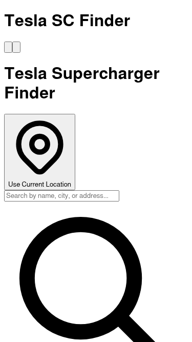

# Tesla Supercharger Finder

[](https://nextjs.org/)
[](https://www.typescriptlang.org/)
[](https://www.docker.com/)
[](LICENSE)
[](https://vitest.dev/)
[](https://vercel.com/)

A web application to find Tesla Superchargers near you with real-time location tracking and nearby facilities information.

## 📸 Screenshots

<div align="center">
  
  <p><em>Desktop view with interactive map and charger list</em></p>
</div>

<div align="center">
  
  <p><em>Mobile responsive design with bottom sheet</em></p>
</div>

## Features

- 🗺️ Interactive map showing Tesla Supercharger locations
- 📍 Automatic user location detection
- 📏 Distance calculation from your current location
- 🔍 Real-time search and filtering by status, amenities, country, and stall count
- 🏪 Nearby entertainment spots and facilities (restaurants, cafes, shopping, etc.)
- 📱 Responsive design with mobile-friendly sidebar
- 🚀 Free map display (using OpenStreetMap/Leaflet)

## 🚀 Quick Start

```bash
# Clone and start in under 2 minutes!
git clone https://github.com/wshino/tesla-sc.git && cd tesla-sc
docker-compose up
# Open http://localhost:3000
```

## 💻 Tech Stack

- **Frontend**: Next.js 14 (App Router), React 18, TypeScript
- **Map**: Leaflet (open-source, no API key needed)
- **Nearby Places**: Google Places API (optional)
- **Styling**: Tailwind CSS
- **Testing**: Vitest, React Testing Library, Playwright (E2E)
- **Development**: Docker, pnpm
- **Deployment**: Vercel

## 📋 Prerequisites

- **Docker** (version 20.10 or higher)
- **Docker Compose** (version 2.0 or higher)
- **Git**
- **Node.js** 18+ (optional, only if running without Docker)
- **pnpm** 10.11.1 (optional, only if running without Docker)

## 🛠️ Installation

### Option 1: Docker Setup (Recommended)

```bash
# 1. Clone the repository
git clone https://github.com/wshino/tesla-sc.git
cd tesla-sc

# 2. Copy environment variables
cp .env.example .env.local

# 3. (Optional) Add Google Maps API key for nearby places
# Edit .env.local and add:
# NEXT_PUBLIC_GOOGLE_MAPS_API_KEY=your-api-key-here

# 4. Start with Docker
docker-compose up -d

# 5. Open in browser
open http://localhost:3000
```

### Option 2: Local Setup (Without Docker)

```bash
# 1. Clone the repository
git clone https://github.com/wshino/tesla-sc.git
cd tesla-sc

# 2. Install pnpm if not already installed
corepack enable
corepack prepare pnpm@10.11.1 --activate

# 3. Install dependencies
pnpm install

# 4. Copy environment variables
cp .env.example .env.local

# 5. (Optional) Add Google Maps API key
# Edit .env.local

# 6. Run development server
pnpm dev

# 7. Open in browser
open http://localhost:3000
```

### 🔑 API Keys

The app works without any API keys! To enable optional features:

1. **Google Places API** (for nearby facilities):
   - Get an API key from [Google Cloud Console](https://console.cloud.google.com/)
   - Enable "Places API" and "Maps JavaScript API"
   - Add to `.env.local`: `NEXT_PUBLIC_GOOGLE_MAPS_API_KEY=your-key-here`

2. **Mapbox API** (alternative map provider, not required):
   - Get a token from [Mapbox](https://www.mapbox.com/)
   - Add to `.env.local`: `NEXT_PUBLIC_MAPBOX_TOKEN=your-token-here`

## 🔧 Development

### Running locally without Docker

```bash
# Install dependencies
pnpm install

# Run development server
pnpm dev

# Run tests
pnpm test

# Build for production
pnpm build
```

### Docker Commands

```bash
# Enter container shell
docker-compose exec app sh

# Install new packages
docker-compose exec app pnpm add <package-name>

# Run type check
docker-compose exec app pnpm type-check

# Run linter
docker-compose exec app pnpm lint

# Run tests
docker-compose exec app pnpm test

# Format code
docker-compose exec app pnpm format
```

### 🧪 Testing

```bash
# Unit tests
docker-compose exec app pnpm test

# E2E tests (requires Playwright browsers)
docker-compose exec app pnpm test:e2e

# E2E tests for CI (uses system Chromium)
docker-compose exec app pnpm test:e2e:ci

# Basic E2E tests only (faster, for CI)
docker-compose exec app pnpm test:e2e:ci:basic
```

**Note on E2E Tests:**

Some E2E tests require external API keys:

- Nearby places functionality tests (requires Google Maps API key)
- Map integration tests that require real map data
- Location-based features that need geocoding services

**Local Development:** All tests will run if you have API keys configured in `.env.local`
**CI Environment:** Tests requiring API keys are skipped to prevent failures. The app itself works without API keys, only the nearby places feature is affected.

## 📁 Project Structure

```
tesla-sc/
├── src/
│   ├── app/                 # Next.js app router pages
│   │   ├── api/            # API routes
│   │   └── page.tsx        # Main page
│   ├── components/         # React components
│   │   ├── LeafletMap.tsx  # Map component
│   │   ├── ChargerList.tsx # Charger list sidebar
│   │   └── ...
│   ├── hooks/              # Custom React hooks
│   ├── lib/                # Utility functions
│   ├── data/               # Static data
│   └── types/              # TypeScript types
├── public/                 # Static assets
├── docker-compose.yml      # Docker configuration
├── Dockerfile.dev          # Development Dockerfile
└── ...
```

## 🗺️ Available Supercharger Data

Currently includes data for:

- **Japan**: Tokyo (Roppongi, Odaiba, Daikanyama, Akasaka, Akihabara, Yaesu), Osaka, Kyoto, Yokohama, Nagoya, Kobe, Fukuoka
- **USA**: Los Angeles, San Francisco, New York, Chicago, Las Vegas, Seattle, Miami, Austin, Boston, Denver, Portland, Phoenix, Nashville, San Diego, Atlanta, Washington DC, Dallas

## 🐛 Troubleshooting

### Common Issues

### Port 3000 is already in use

```bash
# Option 1: Kill the process using port 3000
lsof -ti:3000 | xargs kill -9

# Option 2: Use a different port
# Edit docker-compose.yml:
ports:
  - '3001:3000' # Access via http://localhost:3001
```

### Docker build issues

```bash
# Clean rebuild
docker-compose down -v
docker system prune -af
docker-compose up --build
```

### pnpm version mismatch

```bash
# Option 1: Use the exact version
corepack prepare pnpm@10.11.1 --activate

# Option 2: Bypass version check
COREPACK_ENABLE_STRICT=0 pnpm install
```

### Module not found errors

```bash
# Clear cache and reinstall
rm -rf node_modules pnpm-lock.yaml
pnpm install
```

### Environment variable issues

```bash
# Verify .env.local exists
ls -la .env*

# Check variable format
grep NEXT_PUBLIC .env.local
```

### Still having issues?

1. Check the [Issues](https://github.com/wshino/tesla-sc/issues) page
2. Enable debug mode: `DEBUG=* pnpm dev`
3. Check Docker logs: `docker-compose logs -f app`

## 🤝 Contributing

We welcome contributions! Please see our [Contributing Guidelines](CONTRIBUTING.md) for details.

### Quick contribution guide

1. Fork the repository
2. Create your feature branch (`git checkout -b feature/amazing-feature`)
3. Commit your changes (`git commit -m 'feat: add amazing feature'`)
4. Push to the branch (`git push origin feature/amazing-feature`)
5. Open a Pull Request

## 📄 License

This project is licensed under the MIT License.

## 🙏 Acknowledgments

- Tesla Supercharger location data
- OpenStreetMap for map tiles
- Leaflet for map rendering
